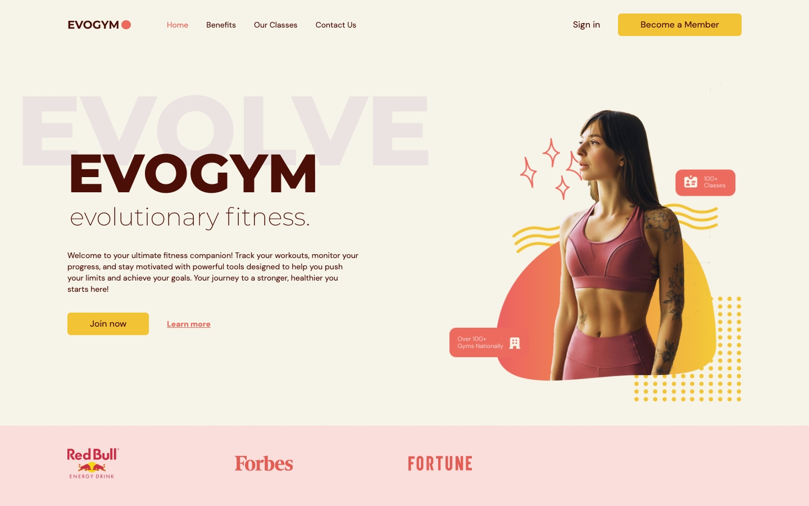
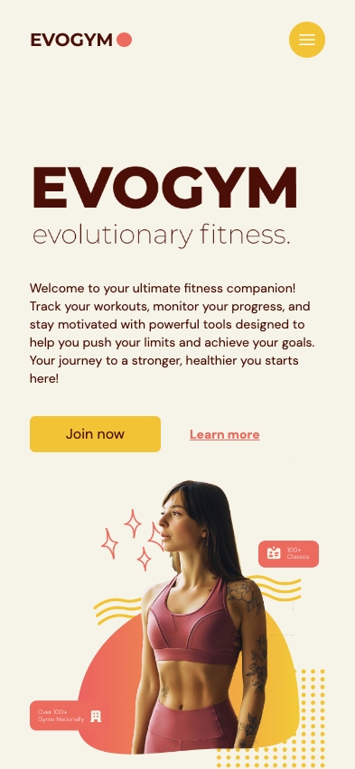

# React Typescript Gym Website 🚀

## Description 📝

A simple and responsive single-page gym UI built with React 19, Tailwind CSS v3, and Vite. This project is a frontend-only prototype focused on layout, design, and modern component structure. Ideal for showcasing frontend skills without backend complexity.

## 🚀 Technologies Used

- ⚛️ **React 19**
- 💻 **Typescript**
- 🎨 **Tailwind CSS v3.4**
- ⚡️ **Vite**

## 📦 Installation and Usage

1. Clone the repository:

   ```sh
   git clone https://github.com/anabelena/react-gym-app.git
   ```

2. Navigate to the project directory:

   ```sh
   cd react-gym-app
   ```

3. Install dependencies:

   ```sh
   npm install
   ```

4. Start the development server:

   ```sh
   npm run dev
   ```

## Screenshots 📷

### 🖥️ Desktop view



### 📱 Mobile view



## 🌐 Live Demo

👉 [react-gym-app.pages.dev](https://react-gym-app.pages.dev)

## Contact 📧

Developed by [anabelena](https://github.com/anabelena)
